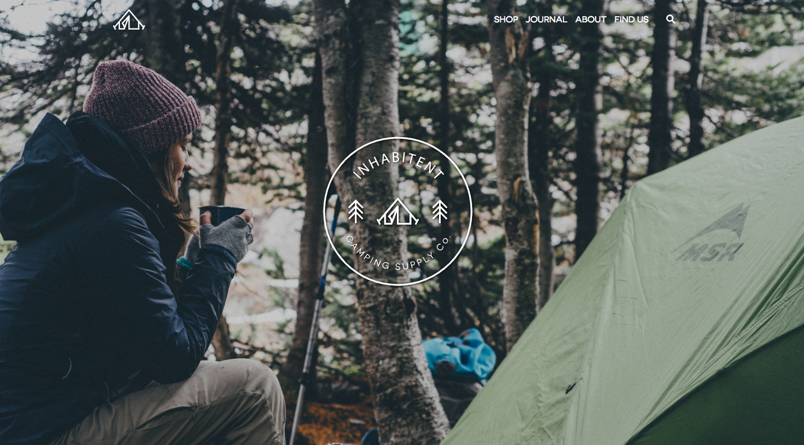

# Inhabitent

## Description
The Inhabitent Project is a WordPress theme built by Tim Nguyen. Inhabitent Site is an ideal site to browse through camping products and camping journals. 

## Screenshots

## Installation 
	
- In your admin panel, go to Appearance > Themes and click the Add New button`
- Search for Inhabitent Theme and install it to your WordPress
- Click Activate to use the Inhabitent Theme.

## Built with

- WordPress
- PHP
- JQuery
- MAMP
- SASS
- Gulp

## Author

Tim Nguyen

## Personal Learnings 

- Learn how to build WordPress Theme and navigate WordPress Template Hierachy
- Format and Set Behaviors of WordPress Theme with PHP, CSS and JavaScript
- Manage Widgets and Plugins in WordPress
